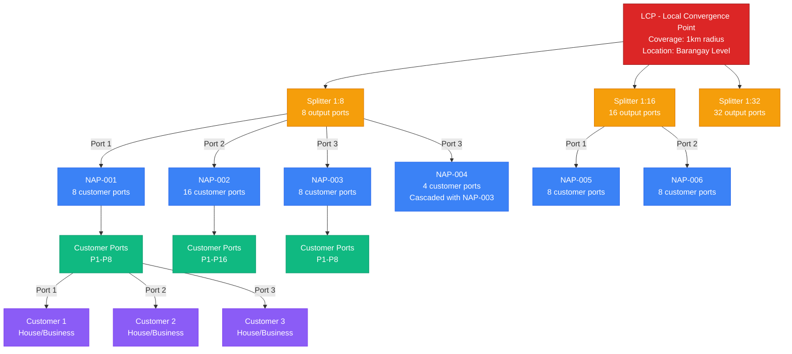

## Network Capacity Calculation Example

### Given:
- 1 LCP with 3 Splitters
  - Splitter 1: Type 1:8 (8 ports)
  - Splitter 2: Type 1:16 (16 ports)
  - Splitter 3: Type 1:32 (32 ports)
- Total Splitter Ports: 8 + 16 + 32 = 56 ports

### If each splitter port connects to NAPs:
- Average NAP has 8 customer ports
- Total Customer Capacity: 56 × 8 = 448 customers

### Real-World Distribution:
- High-density areas: Use 1:32 or 1:64 splitters
- Medium-density: Use 1:16 splitters
- Low-density/Rural: Use 1:4 or 1:8 splitters

### Port Assignment Rules:
1. One NAP port = One customer location
2. Multiple NAPs can share same splitter port (cascading)
3. Each customer gets exclusive port access
4. Unused ports remain available for expansion
